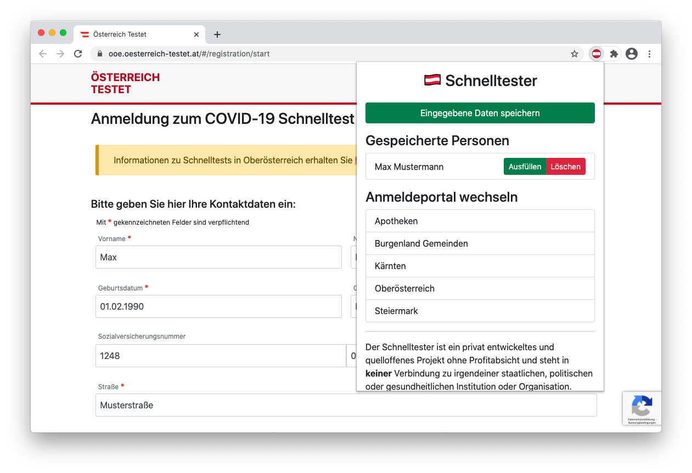

# 🇦🇹 Schnelltester - Österreich Testet Ausfüllhilfe

Schnelltester helps you to register for COVID-19 tests by storing your data locally so you don't have to type in your data every time - like a password manager.



## Data storage information

All personal data is stored locally in the browser (Chrome offers a dedicated area for extensions) and is never synced or uploaded to anywhere.

## Installation

### via Chrome Web Store

Download [here](https://chrome.google.com/webstore/detail/kjjnndnifooahialjiligenpnkdfkije)

### build or install locally

Requirements: Node.js and npm (tested with Node.js 14.15.1 and npm 6.14.8)
```
$ cd extension
$ npm install
$ npm run build-prod
```

Alternatively you can download and unzip the built extension from the release page: [https://github.com/stefanschoeberl/schnelltester/releases](https://github.com/stefanschoeberl/schnelltester/releases)

* Open Chrome and navigate to the extensions settings: [chrome://extensions](chrome://extensions)
* Turn on Developer Mode
* Click on "Load unpacked" / "Entpackte Erweiterungen laden"
* Navigate to `extension/dist` folder or to the unzipped extension folder

Now you should see the loaded extension:

